<div align="center">

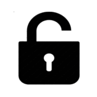
</div>

## Description

This script is designed to encrypt a users root and swap partitions without loosing data. The intention of which is to stop your data from being accessed if your drive (a laptop for example) is stolen.

* <a href="#pre-setup">1.0: Pre-Setup</a>
  * <a href="#required-packages">Required Packages</a>
  * <a href="#get-a-live-cd">Get a Live-CD</a>
  * <a href="#backup-your-system">Backup Your System</a>
  * <a href="#partition-layout">Partition Layout</a>
* <a href="#limitations">2.0: Limitations</a>
  
## Pre-Setup

You <b>cannot</b> encrypt your system while it's in use. You must boot into another system to run this script.
A good choice is to burn a Clonezilla ISO to a USB drive. Clonezilla has all the software that we need to setup encryption on the main drive.

<b color=red>Before proceeding please visit the <a href="#limitations">Limitations(2.0)</a> section to determine if your system is compatible before continuing.</b>

### Required Packages
There are two required packages: initramfs-tools, and cryptsetup. Both are available in the default Ubuntu repositories. And it is assumed that most Ubuntu derivatives will also carry these packages.

    sudo apt update
    sudo apt install cryptsetup initramfs-tools

### Get a Live-CD

<a href="https://mirrors.xtom.com/osdn//clonezilla/71030/clonezilla-live-2.6.1-25-amd64.iso">Download the Clonezilla ISO</a>

If you need an image writer you can <a href="http://wiki.rosalab.ru/ru/images/2/24/RosaImageWriter-2.6.1-lin-x86_64.txz">download</a> RosaImageWriter.

We are using Clonezilla because it's the OS where all testing is being done. That way we make sure the script acts as expected.
If you have a version of Clonezilla already, <b>make sure it's at least version `2.6.1-25`</b>. Because there is bug on (at least) version 2.5.6-22 that when attempting to chroot, all attempts will fail with a `bus error`.

### Backup Your System

Now boot into the Clonezilla USB you've just made. <b>You will also need another drive (that isn't the one you're encrypting) to store the device image</b>.

You'll be prompted to enter your language and keyboard layout. Before arriving at this screen:

```
Choose: Start_Clonezilla
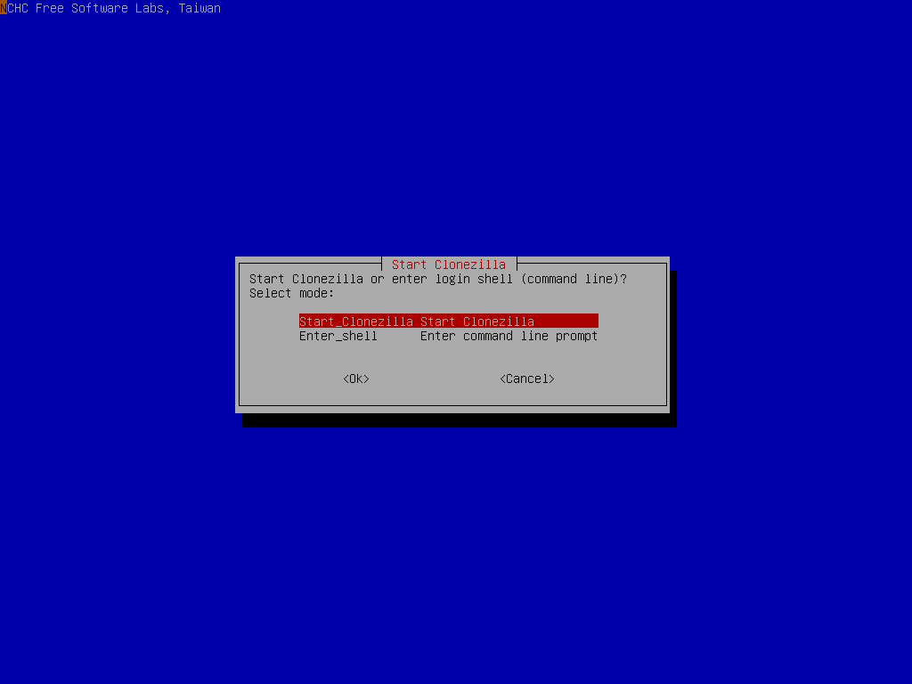

Choose: device-image
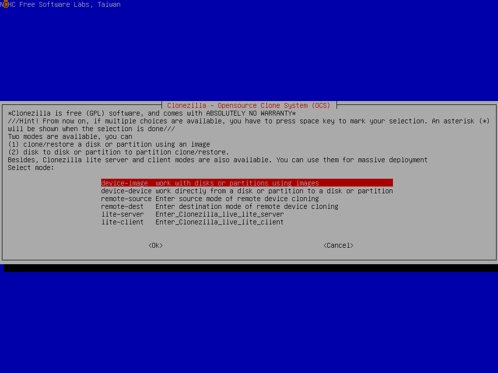

Choose: local_dev
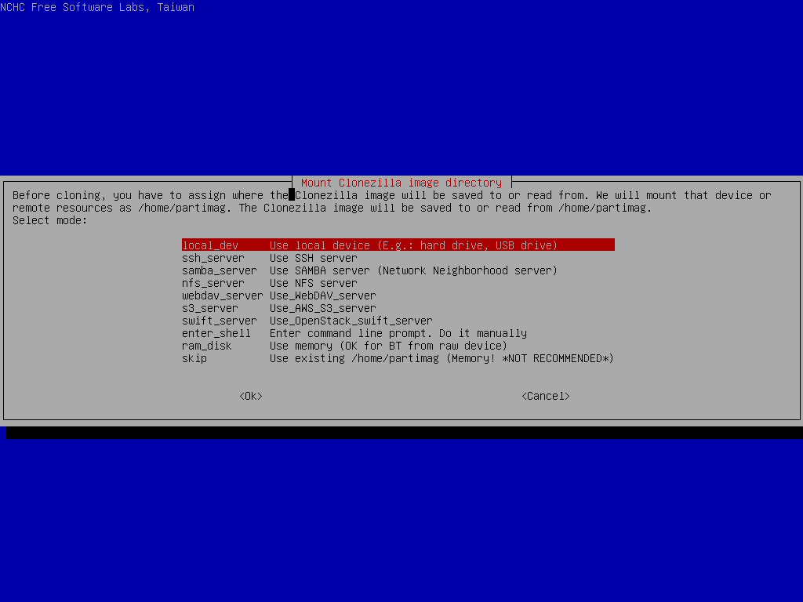

Choose: The device thats not the drive you're encrypting
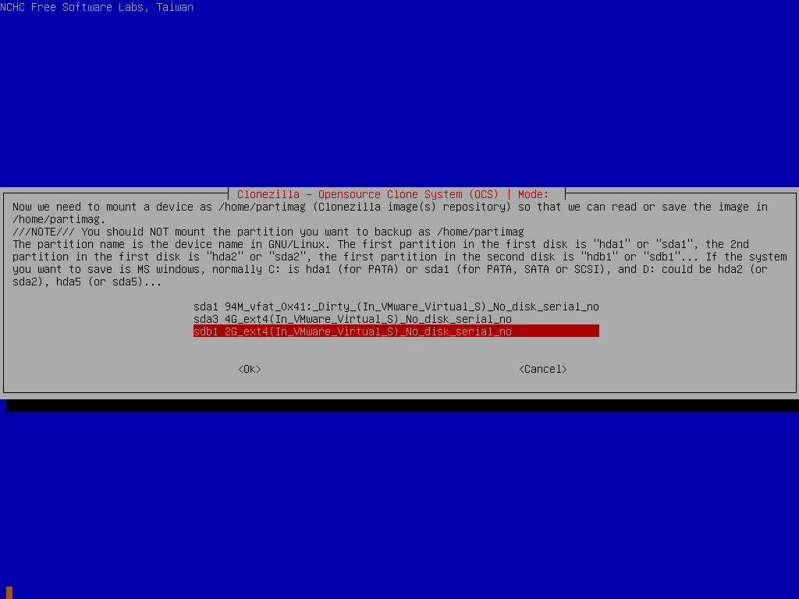

Choose: The directory where you want to store the image
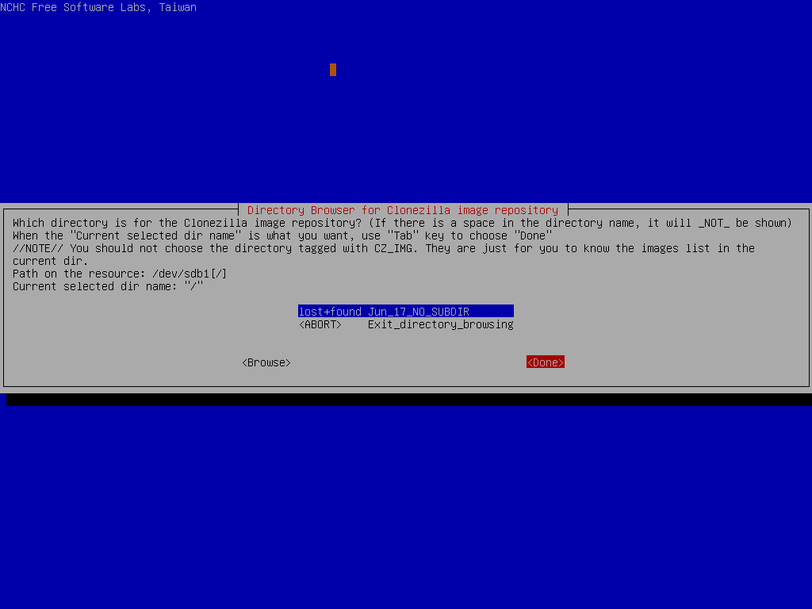

Choose: Beginner
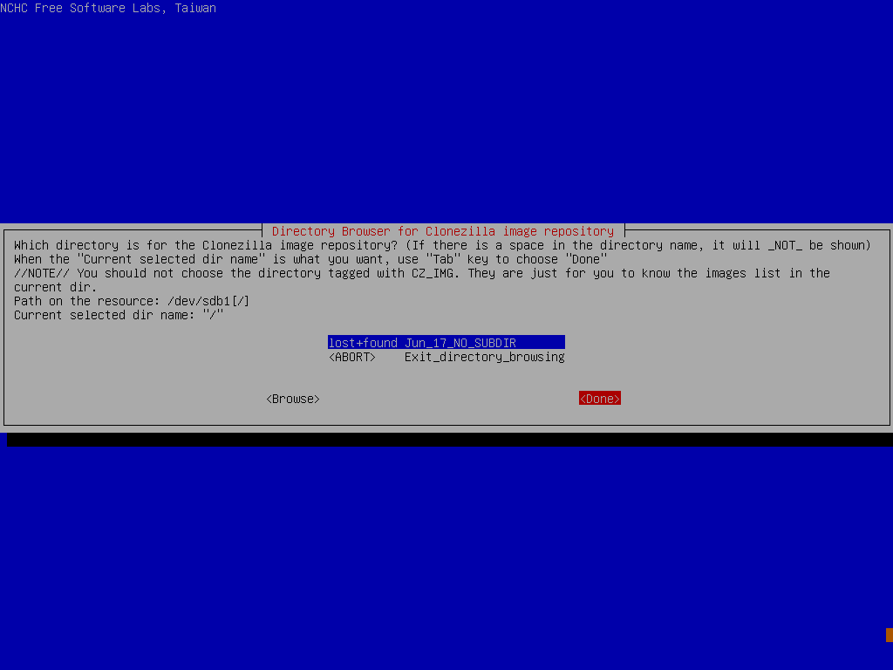

Choose: savedisk
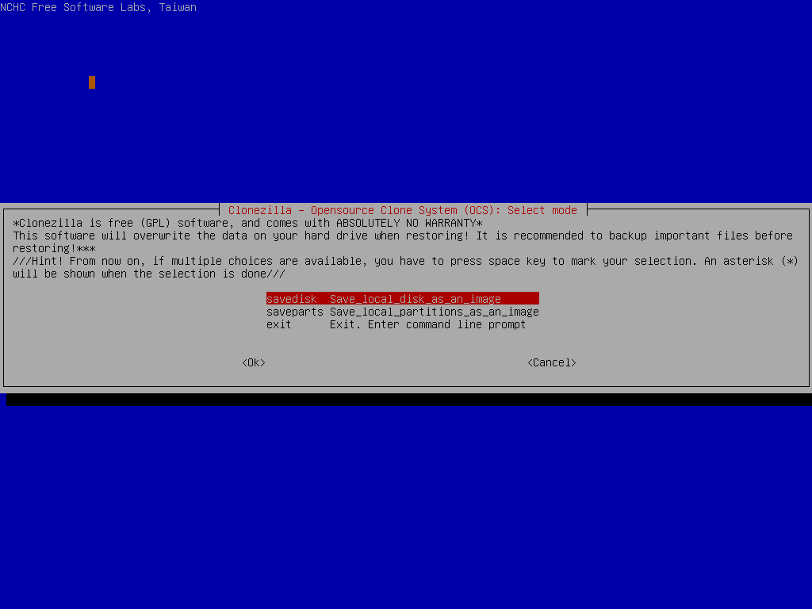

Optionally write a name for your image or leave it as the default.
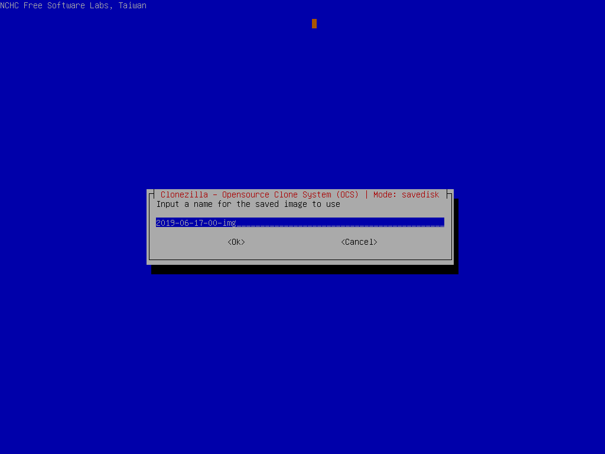

Choose: The drive you want to backup
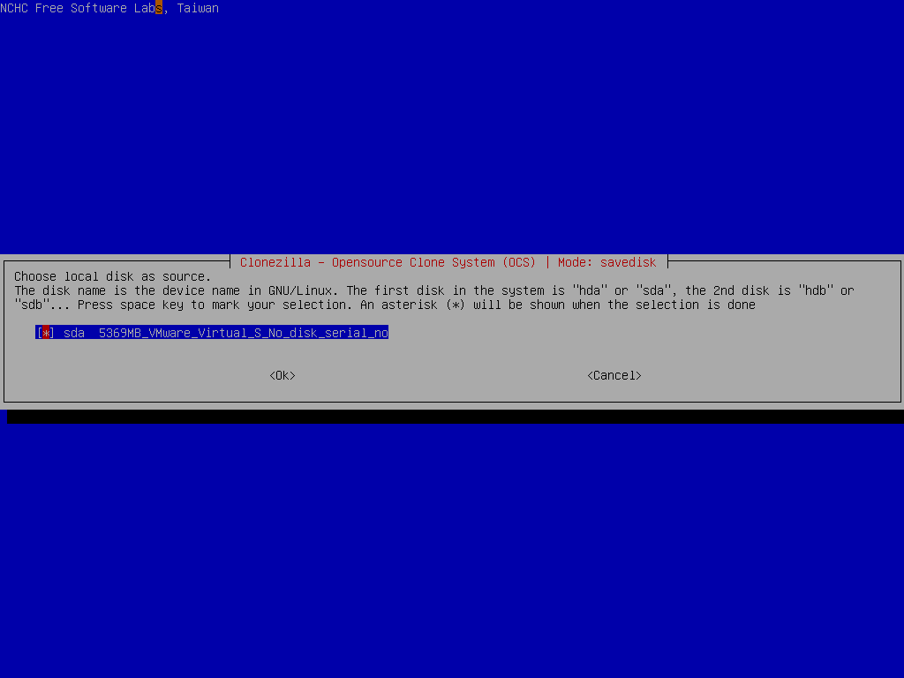

Choose: -sfsck<br>
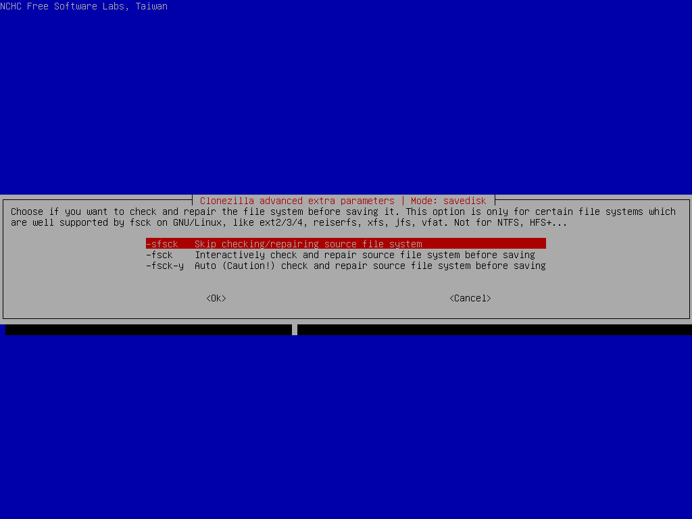

Choose: Yes, check the saved image
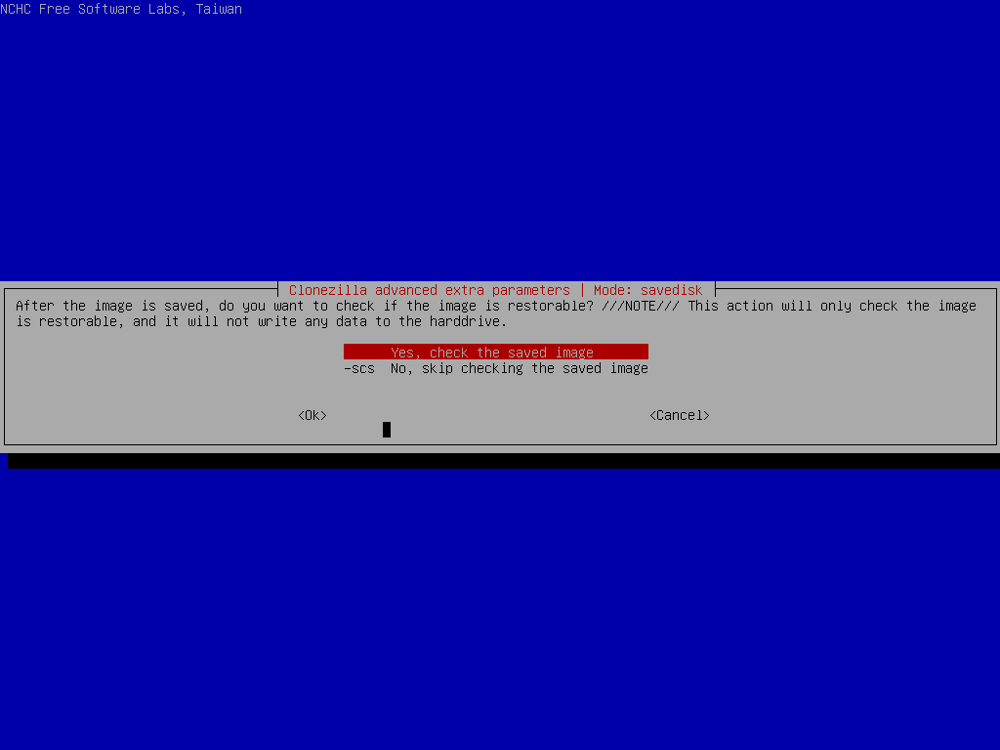

Choose: -senc Not to encrypt the image
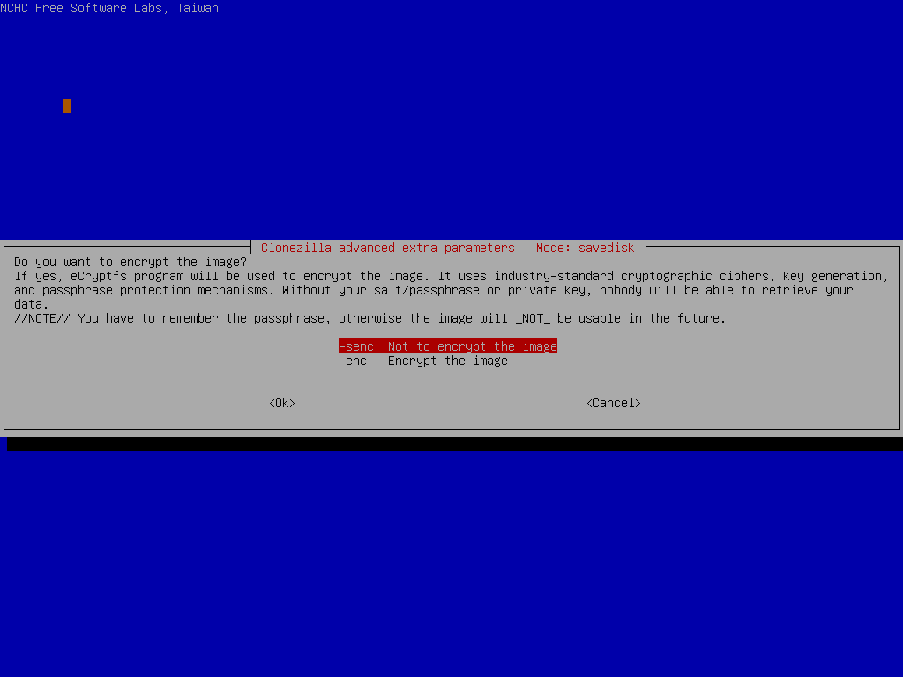

Choose: -p choose (boot into the shell when finished)
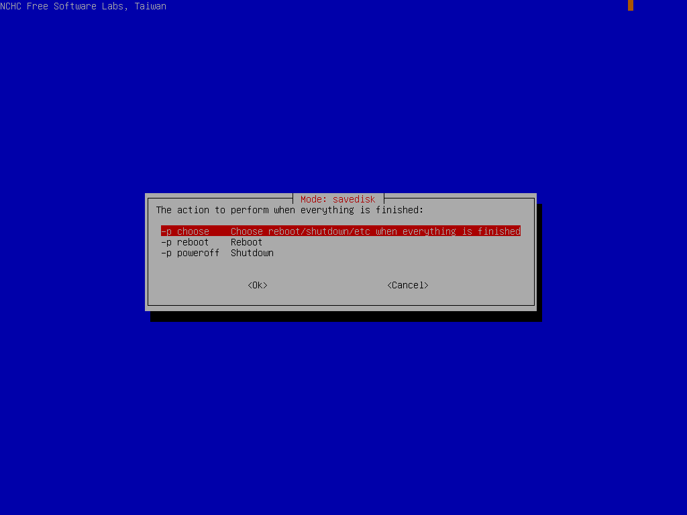
```
### Partition Layout

Before we can start encrypting we need to know the mountpoints of your current partitions.

To get all the partitions on the device run:

    lsblk

Ignore `loop0` (it's the mountpoint of the Clonezilla drive).

First we need to `determine which partition stores your / directory`. To do this you can either:

* Keep mounting partitions ONE AT A TIME into /mnt: `sudo mount /PARTITION /mnt` (Replace PARTITION with the partitions from the lsblk command). Once you've mounted a partition, check its contents with `ls /mnt`. You can unmount the partition with `sudo umount /mnt` <b>IF</b> it does not contain your `/` directory.

* Mount the `/` partition if you know it.

* Reboot into your system and run: `cat /etc/fstab` then take a picture of the output with your phone. Then boot back into the Clonezilla shell (option to boot into shell is the screen just after picking the keyboard).

Once your `/` directory is mounted, `cat /mnt/etc/fstab`.

The output of fstab will look like this:

    # <file system> <mount point>   <type>  <options>       <dump>  <pass>
    /dev/sda1  /  ext4    errors=remount-ro  0       1
    # /boot was on /dev/sda2 during installation
    /dev/sda2  /boot  ext2    defaults       0       2

We are paying attention to the first 2 colums in that file (example: /dev/sda / ). ###STOPPED HERE 

## Limitations

Not compatiable with lvm - notes
Check to see if other non-ubuntu distros work

## Security Concerns

## Download

    curl --location 'https://tinyurl.com/yxekdxwq' > encrypt.sh && chmod 744 encrypt.sh

## Running The Script

Example output for an operation
Explanation of questions the script asks the user.

### Manually Configuring

  All configuration options that are actually run when the script runs\

#### General Configuration

#### Specific for EFI

#### Specific for i386

## Post Execution
reboot system 
recovery options
 - restore from backup (easiest)
 - cryptsetup-reencrypt /dev/partition_of_root --decrypt (will have to reconfigure the system. Cannot be undone!)
 - if both fail acknowledge i take no responsibility for damages

#Reminders to write about:
#State that this tool (for the moment) only is used to 'stapple' encryption onto the drive. Explain the security risks in doing so #and provide alternative methods for acheiving a safer setup.
#Add efi support and signing uefi keys.
#See if it is possible to create an auto-updater, and an option or separate script that embedds and updates the main script in a clonezilla image.
