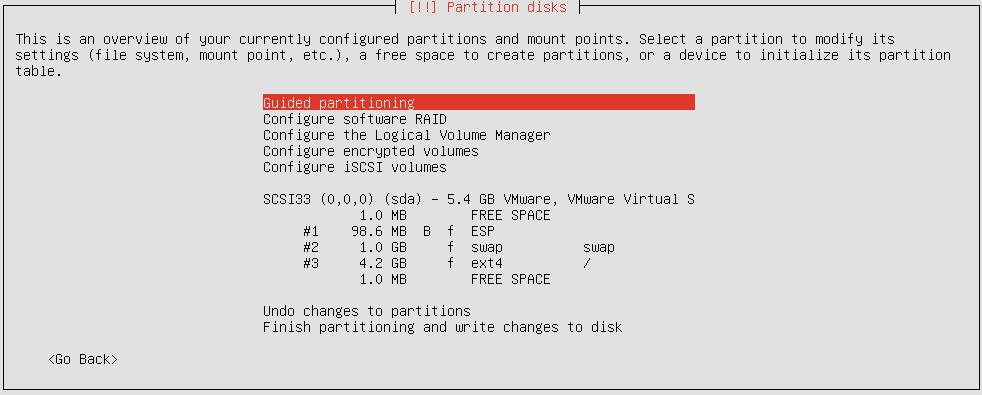
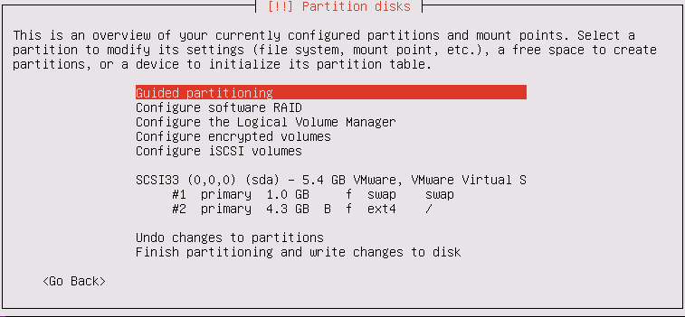
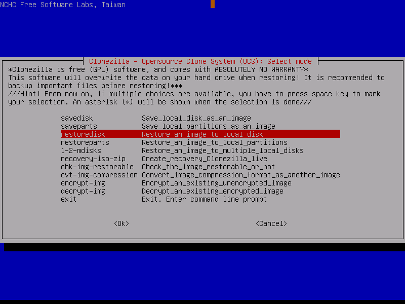

<div align="center">


</div>

## Description

This program aims to automate the encrypting of a users `/` and swap partitions from a live-iso.

* <a href="#10-download">1.0: Download</a>
* <a href="#20-pre-setup">2.0: Pre-Setup</a>
  * <a href="#required-packages">Required Packages</a>
  * <a href="#get-a-live-cd">Get a Live-CD</a>
  * <a href="#backup-your-system">Backup Your System</a>
* <a href="#30-limitations">3.0: Limitations</a>
  * <a href="#compatible-partition-schemes">Compatible Partition Schemes</a>
* <a href="#40-in-depth-operation">4.0: In-Depth Operation</a>
  * <a href="#auto-detect-partition-table-type">Auto Detect Partition Table Type</a>
  * <a href="#encrypting-the-drive">Encrypting the Drive</a>
  * <a href="#setup-chroot-jail">Setup Chroot Jail</a>
  * <a href="#add-root-entry-to-mntetccrypttab">Add Root Entry to /mnt/etc/crypttab</a>
  * <a href="#avoid-entering-your-luks-passphrase-twice">Avoid Entering Your LUKS Passphrase Twice</a>
  * <a href="#configuring-grub">Configuring GRUB</a>
    * <a href="#grub-install-efi">GRUB Install: EFI</a>
    * <a href="#grub-install-i386">GRUB Install: i386</a>
  * <a href="#setting-up-encrypted-swap">Setting Up Encrypted Swap</a>
  * <a href="#update-grub-and-initramfs">Update GRUB and Initramfs</a>
* <a href="#50-recovery">5.0: Recovery</a>
  * <a href="#recover-from-backup">Recover From Backup</a>
  * <a href="#recover-without-a-backup">Recover WITHOUT a Backup</a>

## 1.0: Download

    curl 'https://raw.githubusercontent.com/ReallySecureShell/Full_Disk_Encryption/master/main.sh' > encrypt.sh && chmod 744 encrypt.sh

Or use the shortend URL: 

    curl --location 'https://tinyurl.com/yxekdxwq' > encrypt.sh && chmod 744 encrypt.sh

## 2.0: Pre-Setup

You <b>cannot</b> encrypt your system while it's in use. You must boot into another system to run this script.
A good choice is to burn a Clonezilla ISO to a USB drive. Clonezilla has all the software that we need to setup encryption on the main drive.

<b color=red>Before proceeding please visit the <a href="#compatible-partition-schemes">Compatible Partition Schemes</a> subsection to determine if your system is compatible before continuing.</b>

### Required Packages
There are two required packages: initramfs-tools, and cryptsetup. Both are available in the default Ubuntu repositories. And it is assumed that most Ubuntu derivatives will also carry these packages.

    sudo apt update
    sudo apt install cryptsetup initramfs-tools

### Get a Live-CD

<a href="https://mirrors.xtom.com/osdn//clonezilla/71030/clonezilla-live-2.6.1-25-amd64.iso">Download the Clonezilla ISO</a>

If you need an image writer you can <a href="http://wiki.rosalab.ru/ru/images/2/24/RosaImageWriter-2.6.1-lin-x86_64.txz">download</a> RosaImageWriter.

We are using Clonezilla because it's the OS where all testing is being done. That way we make sure the script acts as expected.
If you have a version of Clonezilla already, <b>make sure it's at least version `2.6.1-25`</b>. Earlier versions have a problem with chrooting that causes a <i>bus error</i> to be thrown.

### Backup Your System

Now boot into the Clonezilla USB you've just made. <b>You will also need another drive (that isn't the one you're encrypting) to store the device image</b>.

You'll be prompted to enter your language and keyboard layout. Before arriving at this screen:

Choose: Start_Clonezilla


Choose: device-image


Choose: local_dev


Choose: The device thats not the drive you're encrypting


Choose: The directory where you want to store the image


Choose: Beginner


Choose: savedisk<br>


Optionally write a name for your image or leave it as the default.


Choose: The drive you want to backup


Choose: -sfsck<br>


Choose: Yes, check the saved image


Choose: -senc Not to encrypt the image


Choose: -p choose (boot into the shell when finished)


## 3.0: Limitations

| Drawbacks and Shortcomings |
| --- |
| Only works with i386 and x86_64 systems |
| Incompatible with LVM (<a href="https://wiki.archlinux.org/index.php/Dm-crypt/Encrypting_an_entire_system#LUKS_on_LVM">although it is still possible to setup encryption on LVM</a>) | 
| Only supports "basic" partitioning schemes (see section: <a href="#compatible-partition-schemes">Compatible Partition Schemes</a>) |
| Vulnerable to <a href="https://en.wikipedia.org/wiki/Evil_maid_attack">Evil-Maid</a> attacks | 
| Uses LUKS version 1 (<a href="https://savannah.gnu.org/bugs/?55093">because grub does not support</a> <a href="https://gitlab.com/cryptsetup/cryptsetup/blob/master/docs/v2.0.0-ReleaseNotes">LUKS version 2</a>) |
| Requires initramfs-tools instead of the more common dracut utility (If initramfs-tools are not in the repository you'll have to install it from <a href="https://wiki.debian.org/initramfs-tools">source</a>) |

### Compatible Partition Schemes

The diagram that follows details known working partition schemes. If your partitions do not match any of the following there is NO GUARANTEE that the script will operate properly.

Note: The partition "ROOT" is <b>implicit</b> to all files/directories (except for the swapfile). For example, if you could have a separate `/home` partition, it would be explicitly specified.

Each block specifies a whole drive. With ROOT, SWAPFILE/SWAP, and EFI representing partitions on those drives.

```
1: ________________________       2: ________________________ 
  |          EFI           |        |          EFI           |
  |------------------------|        |------------------------|
  |          ROOT          |        |          ROOT          |
  |________________________|        |        SWAPFILE        |
  |          SWAP          |        |________________________|
  |________________________|        |                        |
  |    EFI in /boot/efi    |        |    EFI in /boot/efi    |
  |________________________|        |________________________|
  

3: ________________________       4: ________________________ 
  |          DOS           |        |          DOS           |
  |------------------------|        |------------------------|
  |                        |        |                        |
  |          ROOT          |        |          ROOT          |
  |                        |        |        SWAPFILE        |
  |________________________|        |                        |
  |          SWAP          |        |                        |
  |________________________|        |________________________|

```

The following are examples of how one would setup their partitions to meet the requirements above.

#### Example for EFI



#### Example for DOS



## 4.0: In-Depth Operation

The following subsections will discuss the inner workings of the script. This information is provided to help the user replicate and improve upon the existing code. <b>Be aware that the following code is only detailing the core functionality of the script</b>.

### Auto Detect Partition Table Type

This function is called `FUNCT_detect_partition_table_type`. Its purpose is to detect weather the partition table is DOS or EFI.

First we check if the mounted partition (your `/`) contains the `x86_64-efi` directory:

```bash
...
#Has grub been installed with EFI support?
if [ -d '/mnt/boot/grub/x86_64-efi' ]
then
...
```
If so, try to get the UUID of the EFI partition from /mnt/etc/fstab:

```bash
_uuid_of_efi_part=`sed -n '/\/boot\/efi/{
   /^UUID\=/{
    s/^UUID\=//
    s/ .*//
    p
}
}' /mnt/etc/fstab`
```
If the variable `_uuid_of_efi_part` is *not* empty then attempt to mount the EFI partition by its UUID:

```bash
#Mount the EFI partition in /mnt/boot/efi
printf '[%bINFO%b] Mounting potential EFI partition: %s\n' $YELLOW $NC $_uuid_of_efi_part >&2
sudo mount --uuid $_uuid_of_efi_part /mnt/boot/efi
```
Now make sure that the partition is a valid EFI partition with a simple check.
Take note of the first ELSE statement; if the file we are checking for doesn't exist, increment the counter by 1.
The second IF statement checks if the counter is any number greater than 0.
If `counter` is greater than 0 use DOS (`unset _uuid_of_efi_part`), else use EFI.

```bash
#Check /mnt/boot/efi, basic check to see if the files in there exist or not.
local counter=0
for EFI_FILES in '/mnt/boot/efi/EFI/boot/BOOTX64.EFI' '/mnt/boot/efi/EFI/boot/fbx64.efi'
do
  if [ -e $EFI_FILES ]
  then
    printf 'Verified existence of: %s\n' $EFI_FILES
  else
    printf '%s: Does not exist\n' $EFI_FILES
    counter=$(($counter+1))
   fi
done

#Did one or more critical EFI files go undiscovered?
if [[ $counter -gt '0' ]]
then
  unset _uuid_of_efi_part
else
  printf '[%bOK%b]   %s: is a valid EFI partition\n' $GREEN $NC $_uuid_of_efi_part >&2
fi
```

The `_uuid_of_efi_part` variable is used to determine if GRUB will be installed for EFI or DOS as well as mounting the EFI partition by its UUID.

### Encrypting the Drive

First we run an fsck on the partition we've previously choosen. 
If this isn't done we will get an error when attempting to resize the disk.

```bash
sudo e2fsck -fy $1
```

Now shrink the filesystem down to its smallest possible size.

```bash
sudo resize2fs -M $1
```

Encrypt the drive, note that LUKS1 is being used because GRUB does not yet support LUKS2.

```bash
sudo cryptsetup-reencrypt --new --type=luks1 --reduce-device-size 4096S $1
```

Ask the user what the device containing the decrypted LUKS partition should be called. The decrypted device is mounted into /dev/mapper/The_Name_You_Choose

```bash
#Ask the user what the mapper name for the root filesystem should be.
read -p 'Root filesystem mapper name [rootfs]: '

#If input is left blank, then set the mapper name to 'rootfs'.
case $REPLY in
  "")
   _rootfs_mapper_name='rootfs'
  ;;
  *)
   _rootfs_mapper_name=$REPLY
  ;;
esac

#Open the root filesystem as a mapped device.
sudo cryptsetup open $1 $_rootfs_mapper_name
```

Now resize the partition back to its original size.

```bash
sudo resize2fs /dev/mapper/$_rootfs_mapper_name
```

Bind: /dev, /sys, and /proc into the decrypted LUKS device. If you do not do this then you WILL run into problems when running within the chroot jail.

### Setup Chroot Jail

```bash
for _bindings_for_chroot_jail in dev sys proc
do
  if [[ `mountpoint /mnt/$_bindings_for_chroot_jail 2>/dev/null` != "/mnt/$_bindings_for_chroot_jail is a mountpoint" ]]
  then	
   sudo mount --bind /$_bindings_for_chroot_jail /mnt/$_bindings_for_chroot_jail
  fi
done
```

### Add Root Entry to /mnt/etc/crypttab

Get the UUID of the root filesystem. The variable `_sed_compatible_rootfs_mount_name` takes the value of `_initial_rootfs_mount` and adds a back-slash (`\`) *before* all forward-slash (`/`) characters. For instance, if the value of `_initial_rootfs_mount` is `/dev/sda1`, once it is parsed in the sed statement it becomes `\/dev\/sda1`. This is so the second sed statement is able to correctly parse the partition name.

```bash
local _sed_compatible_rootfs_mount_name=$(sed 's/\//\\\//g' <<< $_initial_rootfs_mount)

local _rootfs_uuid=$(sed -n '/'"$_sed_compatible_rootfs_mount_name"'/{
 s/^.*:\ //
 s/\ .*//
 s/UUID\=//
 s/[\"]//g
 p
 }' <<< `sudo chroot /mnt blkid`)
```

Ask the user if they want to enable discards on Solid-State Drives. Read <a href="https://asalor.blogspot.com/2011/08/trim-dm-crypt-problems.html">this article</a> for more information.

```bash
function __subfunct_trim(){
 read -p 'Allow TRIM operations for solid-state drives? (y/N): '

 #Using the default $REPLY variable since it is automatically assigned anyway.
 #And it saves writting a variable that will be used only once.
 case $REPLY in 
  y|Y)
   discard=',discard'
  ;;
  n|N)
   discard=''
  ;;
  *)
   __subfunct_trim
  ;;
 esac
}
__subfunct_trim
```

Build the configuration variable `_crypttab_rootfs_entry`, take own of /mnt/etc/crypttab, append the value of `_crypttab_rootfs_entry` into /mnt/etc/crypttab, then set the owner back to root.

```bash
#Now write the entry for the root filesystem in /etc/crypttab	
local _crypttab_rootfs_entry="$_rootfs_mapper_name UUID=$_rootfs_uuid none luks$discard,keyscript=/etc/initramfs-tools/hooks/unlock.sh"

#Take own of the crypttab file so we can write to it.
sudo chown $USER:$USER /mnt/etc/crypttab

#Append the value of the above variable into /etc/crypttab
echo "$_crypttab_rootfs_entry" >> /mnt/etc/crypttab

#Set crypttab to be owned by root.
sudo chown root:root /mnt/etc/crypttab

#Unset the discard variable
unset discard
```

### Avoid Entering Your LUKS Passphrase Twice

The purpose of creating a key and script file is so we don't have to enter our decryption passphrase twice when booting. Normally you will be asked twice for the passphrase, once by GRUB, and once by initramfs. The following code embeds a script that will echo a keyfile to STDIN (just as if you were the one entering the passphrase). A keyfile will also be generated and added as our second LUKS passphrase, it too is embedded in initramfs.

Generate a 2kB file from random data. This will be used as the key to unlock initramfs.

```bash
dd if=/dev/urandom count=4 bs=512 of=unlock.key
```

Add key to the root device.

```bash
sudo cryptsetup luksAddKey $_initial_rootfs_mount unlock.key
```

Move the key into `/mnt/etc/initramfs-tools/scripts/`. Files in this directory are added into the initramfs image(s) when running update-initramfs.

```bash
sudo mv unlock.key /mnt/etc/initramfs-tools/scripts/
```

Create the unlock.sh file and change the ownership to the current $USER. Then write a short shell script that will echo the key when initramfs asks for any existing LUKS passphrase.

```bash
sudo touch /mnt/etc/initramfs-tools/hooks/unlock.sh

sudo chown $USER:$USER /mnt/etc/initramfs-tools/hooks/unlock.sh

cat << _unlock_script_file_data > /mnt/etc/initramfs-tools/hooks/unlock.sh
#!/bin/sh

cat /scripts/unlock.key

exit 0
_unlock_script_file_data
```

Now, set the ownership for both the unlock.sh and unlock.key files to root, and apply restrictive permissions to both files.

```bash
#Set ownership for unlock.sh back to root and set unlock.key to be owned by root also.
sudo chown root:root /mnt/etc/initramfs-tools/hooks/unlock.sh
sudo chown root:root /mnt/etc/initramfs-tools/scripts/unlock.key 

#Set restrictive permissions on the keyscript and keyfile.
sudo chroot /mnt chmod 100 /etc/initramfs-tools/hooks/unlock.sh
sudo chroot /mnt chmod 400 /etc/initramfs-tools/scripts/unlock.key
```

### Configuring GRUB

Append `GRUB_ENABLE_CRYPTODISK=y` into /mnt/etc/default/grub. And configure GRUB to pre-load the `luks, and cryptodisk modules`.
There is extra code here to keep your grub config file looking nice. We do this by appending the first option (GRUB_ENABLE_CRYPTODISK) below the default `GRUB_CMDLINE_LINUX=""` option. Then we set the second option (GRUB_PRELOAD_MODULES) below the previous option (GRUB_ENABLE_CRYPTODISK).

```bash
#Enable cryptodisks
sudo sed -Ei 's/GRUB_CMDLINE_LINUX="(.*?)\"/&\nGRUB_ENABLE_CRYPTODISK=y/' /mnt/etc/default/grub

#Have grub preload the required modules for luks and cryptodisks.
sudo sed -Ei 's/GRUB_ENABLE_CRYPTODISK=y/&\nGRUB_PRELOAD_MODULES="luks cryptodisk"/' /mnt/etc/default/grub
```

The top of your /mnt/etc/default/grub file should now look something like this:

```
...
GRUB_DEFAULT=0
GRUB_TIMEOUT_STYLE=hidden
GRUB_TIMEOUT=0
GRUB_DISTRIBUTOR=`lsb_release -i -s 2> /dev/null || echo Debian`
GRUB_CMDLINE_LINUX_DEFAULT="splash quiet"
GRUB_CMDLINE_LINUX=""
GRUB_ENABLE_CRYPTODISK=y               <---
GRUB_PRELOAD_MODULES="luks cryptodisk" <---
...
```
#### GRUB Install: EFI

Mount the EFI partition by its UUID. 

```bash
sudo mount --uuid $_uuid_of_efi_part /mnt/boot/efi
```
Install GRUB with the necessary modules and change the default boot directory to: `/boot/efi/EFI/ubuntu`.

```bash 
sudo chroot /mnt grub-install --target=x86_64-efi --efi-directory=/boot/efi --bootloader=ubuntu --boot-directory=/boot/efi/EFI/ubuntu --modules="part_gpt part_msdos" --recheck
```

Now use `grub-mkconfig` to generate a new config file for our GRUB install.

```bash
sudo chroot /mnt grub-mkconfig -o /boot/efi/EFI/ubuntu/grub/grub.cfg
```

#### GRUB Install: i386

Since GRUB installs to the MBR itself, we do not specify a partition but rather the entire drive (ex: /dev/sda). So using a pure BASH statement, remove the trailing partition number from whatever is stored in `_initial_rootfs_mount`. We are then left with just the drive path (again: /dev/sda). 

```bash
#Remove partition numbers from the end of the root device.
local _grub_install_device=${_initial_rootfs_mount%%[0-9]}
```

Now install GRUB for the i386 platform.

```bash
#Install grub with i386 architecture support ONLY.
sudo chroot /mnt grub-install --modules="part_gpt part_msdos" --recheck $_grub_install_device
```

### Setting Up Encrypted Swap

This section will be about how the script sets up an encrypted swap partition. Before any setup for the swap partition begins, the script will run `sudo chroot /mnt blkid -t TYPE="swap"` to determine if any swap partitions even exist. If no swap partitions are found the script will immediately hit a `return 0` statement causing the function to exit.

Get the swap partition to encrypt.

```bash
#Ask the user for the swap partition to encrypt 
read -p 'Partition containing the SWAP filesystem: ' _initial_swapfs_mount
```

Ask the user what name to set for the partition label.

```bash
read -p 'Swap filesystem label name [swapfs]: '

case $REPLY in
 "")
  _swapfs_label_name='swapfs'
 ;;
 *)
  _swapfs_label_name=$REPLY
 ;;
esac
```

Unmount all swap partitions

```bash
sudo chroot /mnt swapoff -a
```

Create a blank 1M filesystem at the beginning of the swap partition.

```bash
sudo chroot /mnt mkfs.ext2 -L $_swapfs_label_name $_initial_swapfs_mount 1M <<< "y"
```

Append an entry for swap in /mnt/etc/crypttab

```bash
#Change ownership of /mnt/etc/crypttab
sudo chown $USER:$USER /mnt/etc/crypttab

echo "swap LABEL=$_swapfs_label_name /dev/urandom swap,offset=2048,cipher=aes-xts-plain64,size=512" >> /mnt/etc/crypttab

#Change ownership back to root
sudo chown root:root /mnt/etc/crypttab
```

Disable all swap entries in /mnt/etc/fstab.

```bash
sudo sed -i 's/.*swap.*/#&/' /mnt/etc/fstab
```

Change ownership of /mnt/etc/fstab, append the new swap entry, then change the ownership back to root.

```bash
sudo chown $USER:$USER /mnt/etc/fstab

#Append new swapfs entry into /mnt/etc/fstab
echo "/dev/mapper/swap none swap sw 0 0" >> /mnt/etc/fstab	

#Reset ownership on /mnt/etc/fstab
sudo chown root:root /mnt/etc/fstab	
```

Edit the `/mnt/etc/initramfs-tools/conf.d/resume` file to now point at the swap's static partition label.

```bash
#Edit the RESUME file found at /etc/initramfs-tools/conf.d/resume
#This is so the resume function will always point to our fixed-named swap partition.
sudo sed -i 's/.*/RESUME=LABEL='"$_swapfs_label_name"'/' /mnt/etc/initramfs-tools/conf.d/resume
```

### Update GRUB and Initramfs

Lastly update the GRUB and initramfs configurations. This is so we can be sure that all previous changes are applied.

```bash
#Update grub
sudo chroot /mnt update-grub	

#Update all initramfs filesystems
sudo chroot /mnt update-initramfs -c -k all
```

## 5.0: Recovery

### Recover From Backup
If you have a backup, then restore it using Clonezilla. The steps to restore to a backup are nearly identical to making a backup. 

Choose <b>restoredisk</b> when prompted with this screen:



### Recover WITHOUT a Backup

If a backup was not created you STILL have a chance at fully recovering your system.

Boot back into Clonezilla and load into a terminal. Once you've done so run the below command.
Doing so will remove all the encryption from the drive (including the LUKS headers).

```bash
sudo cryptsetup-reencrypt --decrypt /dev/<your_root_partition>
```

After the operation is complete, mount the filesystem into `/mnt`.

```bash
sudo mount /dev/<your_root_partition> /mnt
```

Setup chroot environment by binding /sys, /dev, /proc into the mounted filesystem, then chroot into it.

```bash
for i in proc sys dev;do sudo mount --bind /$i /mnt/$i;done

#Now chroot into the filesystem
sudo chroot /mnt
```

Remove initramfs unlock.sh and unlock.key. This is just for cleanup.

```bash
rm /etc/initramfs-tools/hooks/unlock.sh
rm /etc/initramfs-tools/scripts/unlock.key
```

In /etc/crypttab, remove the line that resembles the following:

```
rootfs UUID=4369eca1-a93c-45eb-a00b-e08d58831810 none luks,discard,keyscript=/etc/initramfs-tools/hooks/unlock.sh
```

Remove the following two lines in /etc/default/grub:

```
GRUB_ENABLE_CRYPTODISK=y
GRUB_PRELOAD_MODULES="luks cryptodisk"
```

Now we need to reinstall GRUB. How GRUB is installed depends on the type of partition table (EFI/DOS).

If installing for `i386-pc` note that the device you choose is NOT a partition. For example: if your `/` partition is located on /dev/sda1, then install GRUB on /dev/sda i.e. you simply remove the partition number from the device.

If installing for `x86_64-efi` mount the EFI partition into `/boot/efi` before installing GRUB.

```bash
#For i386-pc
grub-install --recheck /dev/<root_device>

#For x86_64-efi
mount /dev/<EFI_partition> /boot/efi
grub-install --target=x86_64-efi --efi-directory=/boot/efi --bootloader=ubuntu --boot-directory=/boot/efi/EFI/ubuntu --recheck
grub-mkconfig -o /boot/efi/EFI/ubuntu/grub/grub.cfg
```

Update GRUB and initramfs.

```bash
#Update grub configuration.
update-grub

#Re-generate initramfs images for all kernels.
update-initramfs -c -k all
```

Unmount the mounted filesystem.

```bash
#Exit the chroot
exit

#Unmount the bindings.
sudo umount /mnt/{proc,sys,dev}

#If the EFI directory is mounted, unmount it.
sudo umount /mnt/boot/efi

#Unmount the filesystem
sudo umount /mnt
```

Now attempt to boot back into your drive.
